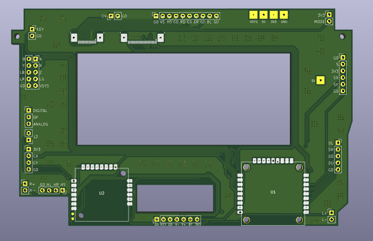
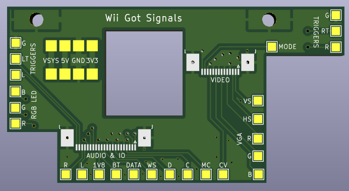
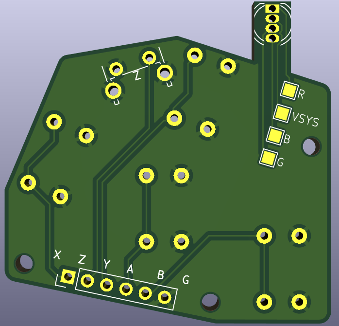
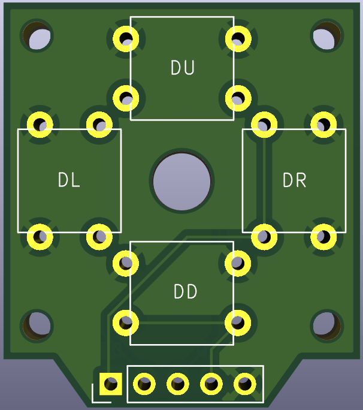
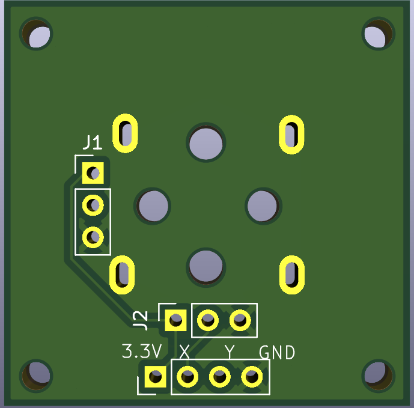
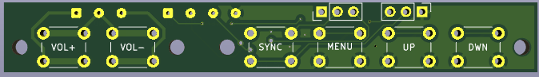
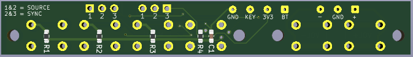

# G-Wii Breakout Boards

Custom KiCad breakout PCBs designed for the **G-Wii portable Wii** project. These boards replace the dozens of individual signal wires typically needed between the two halves of a portable Wii build with clean, modular PCBs and FFC (flat flex cable) connections.

Built in **KiCad 9.0**.

## Boards

### Daughterboard (`Daughterboard/`)
The central connector hub. Interfaces with the trimmed Wii motherboard and consolidates all control, audio, and video signals into organized connectors. Features a **GC+2.0** controller interface IC and a **UAMP** audio amplifier, routing button inputs (A/B/X/Y/Z, D-pad, triggers), analog stick axes, and stereo audio through a single interconnect system.

### Video FLX (`Video_FLX/`)
Video and signal breakout board that routes RGB video (RED, GREEN, BLUE), sync signals (H-Sync, V-Sync), audio lines, and control signals between the two halves of the portable via FFC cables — replacing what would otherwise be 20–30 individual wires.

### ABXY (`ABXY/`)
Face button PCB for the A, B, X, Y, and Z buttons. Uses ALPS SKEYACA010 tactile switches and routes all button signals through a 6-pin connector back to the daughterboard. Also includes a mount for a common-anode tricolour (RGB) LED.

### D-Pad (`DPAD/`)
Directional pad button PCB for Up, Down, Left, and Right inputs.

### Joystick (`joystick/`)
Analog joystick breakout board. Provides connectors for joystick axis signals and mounting, routing back to the daughterboard.

### Tactile Mount (`tactmount/`)
Tactile switch mounting board for auxiliary controls (Start, Select, Home, volume, etc.). Includes signal conditioning with pull-up resistors and decoupling capacitors.

The footprint labelled **SYNC** can act as either SOURVE or a **Bluetooth sync** button depending on jumper configuration — position both jumpers at **1&2** for video source, or **2&3** for BT sync.

The resistor ladder on this board is designed around the **ZJ050NA-08C-KYV-N2** black VGA driver board (board reference](https://bitbuilt.net/forums/threads/resistor-value.6798/)).

## Shared Libraries

- **`4LAYER_FOOTPRINTS.pretty`** — Custom footprints for 4LayerTech components (GC+2.0, PMS, UAMP, etc.)
- **`4LAYER_SCHEMATIC_SYMBOLS`** — Matching schematic symbols
- **`ALPS.pretty`** — ALPS SKEYACA010 tactile switch footprint (custom library — **note:** one of the GND pads is on the wrong side in the current footprint)

## Project Context

The [G-Wii](https://bitbuilt.net/forums/) is a portable Wii console build from the [BitBuilt](https://bitbuilt.net/) community. It uses a trimmed Wii motherboard fitted into a custom handheld case. These breakout boards make wiring significantly cleaner and more reliable by consolidating signals onto PCBs connected via FFC cables.

## License

Open hardware — use and modify freely for your own portable Wii builds.

> **Note:** These boards are not perfect and are provided as-is. You are more than welcome to modify them to suit your build.
